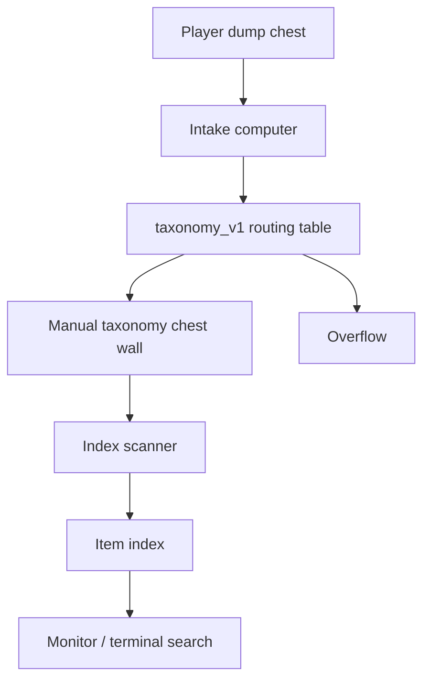

# Storage Roadmap

Refined Storage stays installed, but it is not the main storage solution for the
early and mid game.

## Main Rule

Manual taxonomy storage is the source of truth until the project reaches the
end-game retrieval and autocrafting stage.

Refined Storage is reserved for:

- Autocrafting.
- Request and retrieval workflows.

It should not replace the taxonomy chest wall, intake system, or index system in
v1.

## Roadmap

```text
v1:
  Put things where they belong and tell me what exists.

v2:
  Teach the system new items and connect machines.

end-game:
  Fetch or craft things for me.
```

## v1 Scope

v1 is the early- to mid-game storage system.

It includes:

- Intake system.
- Index system.
- Manual taxonomy chest wall.
- Overflow handling for impossible routing cases.



## v1 Responsibility Split

`intake system`:
Receives dumped items, classifies them against `taxonomy_v1`, moves known items
into the right chest wall section, and sends impossible cases to Overflow.

`index system`:
Scans taxonomy chests and records item name, count, chest, slot, and category
path. It answers "what do we have?" questions.

`manual taxonomy chest wall`:
Remains the physical source of truth. It uses `taxonomy_v1` labels and lets the
player visually understand and correct storage layout.

## Not v1

These features are intentionally out of scope for v1. They should not be added
opportunistically while building the first storage pass.

- Unknown item review workflow.
- Route-table editing from review decisions.
- Mekanism machine logistics.
- Automatic item retrieval.
- Autocrafting.
- Refined Storage as the main storage backend.

Unknown item review and Mekanism logistics belong to v2. Retrieval and
autocrafting belong to the end-game Refined Storage phase.
